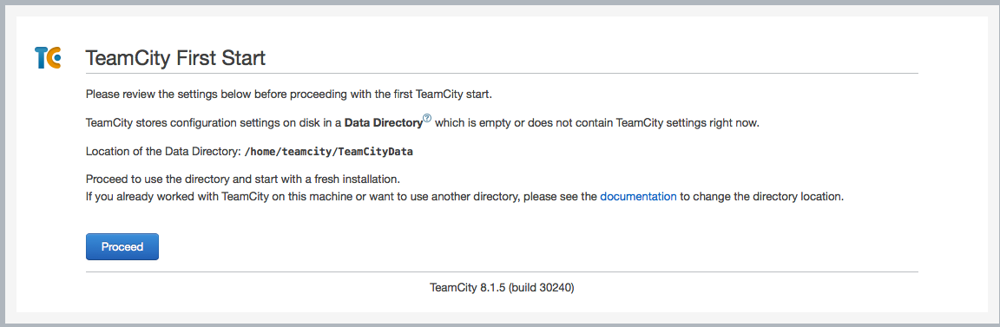
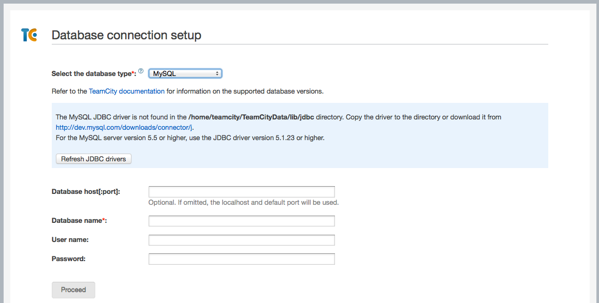
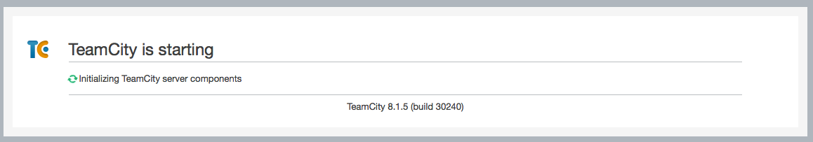

# Team City Installation Using Ansible

## Submodules In Use!

This repository includes a submodule, so make sure to clone it with `$ git clone --recursive`.

## Overview

Install the [Team City](http://www.jetbrains.com/teamcity/) Continuous
Integration system.  For testing purposes, you can use the included
Vagrantfile to install the system on a local VM.  For production, you can use
the same system to configure any server for which you have SSH and root or
sudo access.

## Prerequisites

You will need to [install Ansible](http://docs.ansible.com/intro_installation.html) on your local system.  (I recommend installing using Pip or Homebrew, which are two of the last three methods listed.)

If you want to install on a local VM using the included Vagrantfile, you will also need to install [VirtualBox](https://www.virtualbox.org/) and [Vagrant](https://www.vagrantup.com/).

## Tested Systems

So far, I have only tested on local VM's, using

* Mac OS X 10.9.5
* Ansible 1.7.1
* VirtualBox 4.3.18
* Vagrant 1.6.5
* Virtual machines:
  * Ubuntu 14.04 (Trusty Tahr, [ubuntu/trusty64](https://vagrantcloud.com/ubuntu))
  * CentOS 6.6 ([chef/centos-6.6](https://vagrantcloud.com/chef))

## What Gets Installed

The provisioning script should install the following:

* MySQL server
* A database and user (both named `teamcity`)
* Java Server RE
* TeamCity
* Tomcat server bundled with TeamCity
* Database connector
* A script in `/etc/init.d` so that TeamCity can be controlled with `service`

## Detailed instructions.

Complete the following steps:

1. Download sources
2. Configuration
3. Provisioning
4. Manual installation steps
5. Administration

### 1. Download sources

Download source tarballs for Java RE, TeamCity, and the database connector to the `src/` directory.  See the README there for details.

### 2. Configuration

Edit the variables in `ansible/vars/main.yml` as needed.  If the comments are not clear, then open an issue.  Change the password for the database user, but do not commit it to version control.  (TODO:  there are better ways to manage passwords.)

If you are creating a local VM, then you may change the base box or other parameters in the Vagrantfile.

If you are configuring an external server, then add its server name or IP address to `ansible/hosts`.

### 3. Provisioning

For a local VM, `$ vagrant up`

For an external server,

```
$ ansible-playbook -i ansible/hosts -l <server> ansible/site.yml
```

This will configure all hosts that you have added to the inventory file.  Here `<server>` can be any server or group defined in your inventory file, such as `localhost` or `stage`.  By default (without the `-l` option) the configuration will be run on all servers you have defined there.

### 4. Manual installation steps

Once the application is running, there are some manual steps to create the required configuration. We may choose to automate this at some point, but the remarks in `src/README.md` are relevant, so we may never do so.

1. Open a web browser on http://www.example.com:8111.  If you are using a local VM, then the Vagrantfile specifies that Port 8111 on `localhost` will be forwarded to the same port on the VM, so you can use http://localhost:8111 just as well.  If the provisioning went well (You paid attention to the status messages, didn't you?) you should get a welcome screen:  

2. Click `Proceed` and you should get to the first database-setup screen.  Select `MySQL` from the drop-down list, and you should see something like this:  .

3.  Click `Refresh JDBC drivers` and the status message should turn happy:  .  Fill in `teamcity` as the `Database name` and `User name` and fill in the password configured in `vars/main.yml`.  (For a local VM you can just use the password already there.)  Click `Proceed`.

4. You should get a spinning wheel as TeamCity initializes the database:  .

5. TeamCity should be ready to roll!

### 5. Administration

I do not know, I have not gotten that far.
